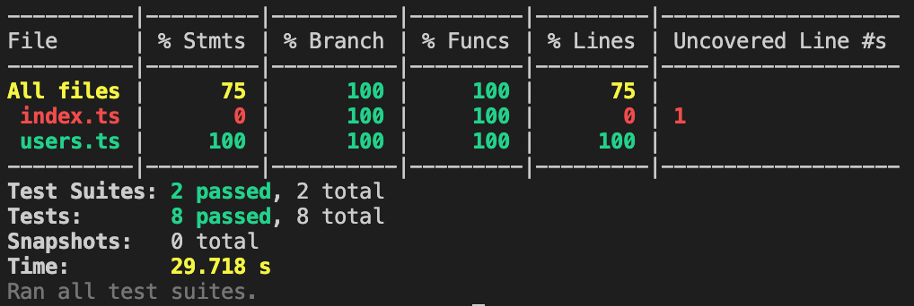

# Testing project [Virtuelleshaus.at](https://www.virtuelleshaus.at/)

Project for testing Virtuelleshaus website for FERIT course "Metode i tehnike testiranja programske podrške"
### instructions to and download the project

* download and install [Visual Studio Code](https://code.visualstudio.com) or any other preferred code editor
* install [Node.js](https://nodejs.org/en/) 
  1. open terminal 
  2. write $node -v and $npm -v
  3. if there is any output then node (and npm) is already installed and this step can be skipped
  4. write $git -v
  5. if there is any output then git is already installed and this step can be skipped

* if git isnt installed
  1. download [Git](https://git-scm.com/downloads)
  2. open .exe or .pkg file and install it by its default settings
  3. open terminal
  4. write $git -v and it should write git version

* if node isnt installed
  1. download [Node.js](https://nodejs.org/en/)
  2. open .exe or .pkg file and install it by its default settings
  3. open terminal
  4. write $node -v and it should write node version

* clone [ferit-mttpp-project](https://github.com/blekso/ferit-mttpp-project)
  1. copy ssh link for this project
  2. open terminal
  3. write $git clone git@github.com:blekso/ferit-mttpp-project.git
  4. open project in preferred code editor

### instructions to and run project tests
* install packages
  1. open terminal
  2. use $cd to enter cloned object directory
  3. write $npm install to install packages

* run project
  1. create .env file in the project
  2. paste contents from .env.example to .env file
  3. write $npm run test in terminal to run tests

**Test cases:**
1. **render_test** - Test case which indicates if the website renders on browser
2. **cookiebanner_show_test** - Test case which indicates if cookie banner pops up while opening the website for the first time
3. **cookiebanner_close_test** - Test case which indicates if cookie banner closes after confirming cookie selection choice
4. **register_test** - Test case which indicates if user can register by entering valid login data
5. **valid_data_login_test** - Test case which indicates if user can login by entering valid login data
6. **invalid_login_data_test** - Test case which indicates if user can login by entering invalid login data 

**Rezultati testiranja:**

After running $npm run test, console will log test case results by showing 

### Author

Mihael Istvan (DRC 1.g)